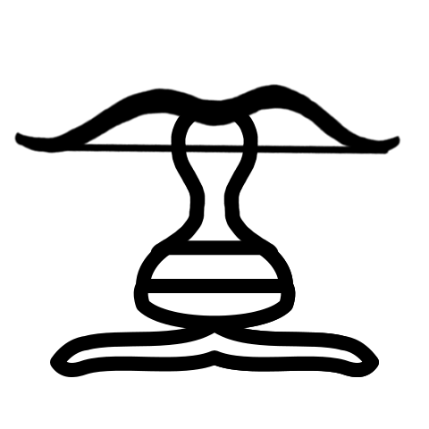
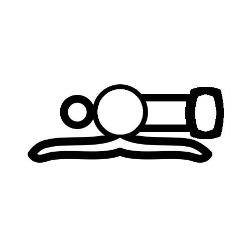

<!DOCTYPE html>
<html>
	<head>
		
	</head>
	<body style="background-color:#404040;">
		

			
				<h1 style="color: #ffe8d1;">The <a style="color: #ffe8d1;" href="https://chesscraft.ca">ChessCraft</a> Piece Library!</h1>
				<table style="width:53.125%;margin-bottom:3px">
					<tr>
						<th style="width:25%">Strength</th>
						<th style="width:25%">Rook</th>
						<th style="width:25%">Bishop</th>
						<th>Knight</th>
					</tr>
				</table>
				

					
					<button id="strength" class="btn" onmousedown = "funStrength(event)" onmousemove = "funMouse(event)" onclick = "funUp(event)" onmouseout = "funUp(event)" onmouseup = "funMouse(event)" style="transform: translate(0px, -22px)">50</button>
				

				

					
					<button id="rook" class="btn" onmousedown = "funRook(event)" onmousemove = "funMouse(event)" onclick = "funUp(event)" onmouseout = "funUp(event)" onmouseup = "funMouse(event)" style="transform: translate(0px, -22px)">33</button>
				

				

					
					<button id="bishop" class="btn" onmousedown = "funBishop(event)" onmousemove = "funMouse(event)" onclick = "funUp(event)" onmouseout = "funUp(event)" onmouseup = "funMouse(event)" style="transform: translate(0px, -22px)">33</button>
				

				

					
					<button id="knight" class="btn" onmousedown = "funKnight(event)" onmousemove = "funMouse(event)" onclick = "funUp(event)" onmouseout = "funUp(event)" onmouseup = "funMouse(event)" style="transform: translate(0px, -22px)">33</button>
				

				<table style="width:53.125%;margin-bottom:3px">		
					<tr>
						<th style="width:25%">Forwardness</th>
						<th style="width:25%">Wideness</th>
						<th style="width:25%">Move/Capture</th>
						<th style="width:25%">Left/Right</th>
					</tr>
				</table>
				

					
					<button id="forwardness" class="btn" onmousedown = "funForward(event)" onmousemove = "funMouse(event)" onclick = "funUp(event)" onmouseout = "funUp(event)" onmouseup = "funMouse(event)" style="transform: translate(0px, -22px)">50</button>
				

				

					
					<button id="wideness" class="btn" onmousedown = "funWide(event)" onmousemove = "funMouse(event)" onclick = "funUp(event)" onmouseout = "funUp(event)" onmouseup = "funMouse(event)" style="transform: translate(0px, -22px)">50</button>
				

				

					
					<button id="move/captr" class="btn" onmousedown = "funMove(event)" onmousemove = "funMouse(event)" onclick = "funUp(event)" onmouseout = "funUp(event)" onmouseup = "funMouse(event)" style="transform: translate(0px, -22px)">50</button>
				

				

					
					<button id="left/right" class="btn" onmousedown = "funSide(event)" onmousemove = "funMouse(event)" onclick = "funUp(event)" onmouseout = "funUp(event)" onmouseup = "funMouse(event)" style="transform: translate(0px, -22px)">50</button>
				

				<button id="sort" onclick=" return funSort(event)" style="color:#ffe8d1">Sort!</button>
				<h1 style = "color:#ffe8d1" id="piece1"></h1>
				<h1 style = "color:#ffe8d1" id="piece2"></h1>
				<h1 style = "color:#ffe8d1" id="piece3"></h1>
				<h1 style = "color:#ffe8d1" id="piece4"></h1>
				<h1 style = "color:#ffe8d1" id="piece5"></h1>
				<h2 style="color:#ffe8d1">The Rules</h2>
				

					

						
						<button id="button2" class="ibtn" onclick=" return func2(event)">0</button>
					

					

						
						<button id="button3" class="ibtn" onclick=" return func2(event)">0</button>
					

					

						
						<button id="button4" class="ibtn" onclick=" return func2(event)">0</button>
					

					

						
						<button id="buttone" class="ibtn" onclick=" return func2(event)">0</button>
					

					

						
						<button id="buttonk" class="ibtn" onclick=" return func2(event)">0</button>
					

					

						
						<button id="buttonr" class="ibtn" onclick=" return func2(event)">0</button>
					

					

						
						<button id="buttonc" class="ibtn" onclick=" return func2(event)">0</button>
					

					

						
						<button id="buttoni" class="ibtn" onclick=" return func2(event)">0</button>
					

				

				

					

						
						<button id="buttonra" class="ibtn" onclick=" return func2(event)">0</button>
					

					

						
						<button id="buttonp" class="ibtn" onclick=" return func2(event)">0</button>
					

					

						
						<button id="buttona" class="ibtn" onclick=" return func2(event)">0</button>
					

					

						
						<button id="buttont" class="ibtn" onclick=" return func2(event)">0</button>
					

					

						
						<button id="buttonm" class="ibtn" onclick=" return func2(event)">0</button>
					

					

						
						<button id="buttonan" class="ibtn" onclick=" return func2(event)">0</button>
					

					

						
						<button id="buttonah" class="ibtn" onclick=" return func2(event)">0</button>
					

					

						
						<button id="buttonca" class="ibtn" onclick=" return func2(event)">0</button>
					

				

			
		

		
	</body>
</html>